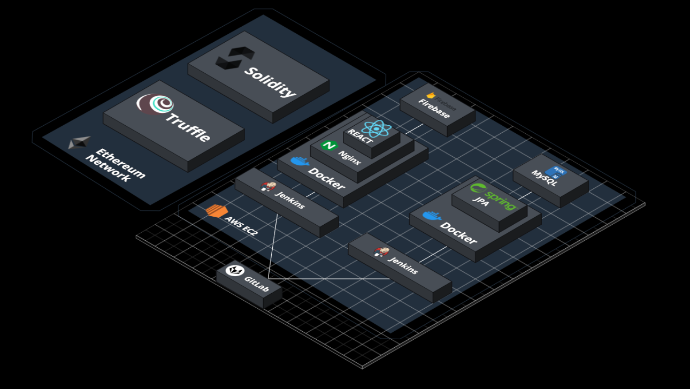
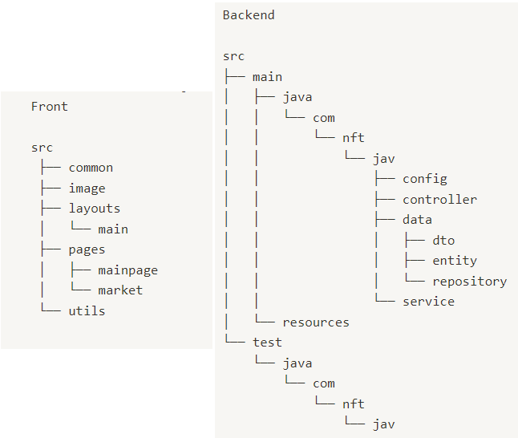
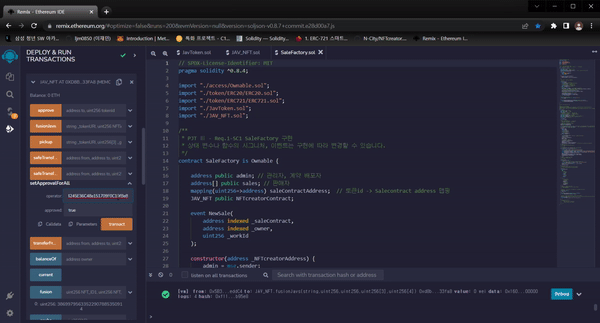

# NFT기반 수집 컨텐츠 : BEASTAZOO

##### 📑 목차

[TOC]

---

 

## 1. 소개

**BEASTZOO**는 **비슷하쥬?**의 언어유희로 NFT 기반의 수집형 컨텐츠 플랫폼입니다.

뽑기와 유전 알고리즘이 적용된 조합을 통해 특정 형태의 NFT를 수집할 수 있으며, 해당 NFT를 마켓플레이스를 이용해 거래할 수 있습니다.

또한 도감 시스템과 보상을 이용해 사용자의 수집 욕구를 극대화 시키고, 상위 NFT로 갈 수록 희귀도가 높아져 자연스럽게 시장 경제가 형성되도록 유도했습니다.

 

---

 

## 2. 주요 기능

> _BEASTAZOO에서 제공하는 주요 기능입니다.
> 서비스를 이해하기 위한 용어를 정의하고 각 기능에서 어떤 것을 경험할 수 있는지 설명하였습니다.
> 이미지와 함께 자세한 설명은 [5.시연시나리오](#5-시연시나리오) 에서 확인하세요!_ 

 

#### 1) 회원 가입 및 로그인

- BEASTAZOO 사이트 내에서 Metamask 지갑 정보를 이용해 회원가입 및 로그인을 진행할 수 있습니다.

 

#### 2) 뽑기

- BEASTAZOO에서 메인 컨텐츠로 사용되는 NFT를 뽑을 수 있는 공간입니다.
- 조합의 기반이 되는 NFT를 전용 거래 토큰인 JAV를 통해 뽑기 페이지에서 얻을 수 있으며, 사용자의 편의성을 위해 1회 뽑기, 10회 뽑기로 나뉘어 있습니다.

 

#### 3) 조합

- 뽑기 페이지를 통해 얻은 베이스 NFT를 조합페이지에서 조합해 새로운 NFT를 얻을 수 있습니다.
- 각각의 NFT에는 유전의 영향을 받는 파츠가 존재하며 이는 2개의 NFT를 조합시 BEASTAZOO만의 유전 알고리즘을 통해 다음 세대의 NFT에게 유전됩니다.
- 유전이 적용되는 각 파츠를 조합할 경우, 일정 확률과 조합식을 통해 기존에는 없던 특정 파츠가 발현됩니다.

 

#### 4) 마켓플레이스

- 내가 얻은 NFT를 마켓플레이스를 통해 거래할 수 있습니다.
- 거래를 통해 새로운 NFT를 얻기 위한 재료를 사용자 간에 거래할 수 있습니다.
- 해당 NFT의 거래 내역, 소유자 정보를 NFT 상세 페이지에서 확인할 수 있습니다.

 

#### 5) 도감

- 도감은 전체 유저가 함께 만들어갑니다.
- 새로운 형태의 NFT가 발견될 경우 도감의 발견 전체 숫자가 올라가며, 해당 NFT에는 발견자의 이름이 기록됩니다.
- 특정 형태의 NFT를 클릭 시에 해당 NFT의 다양한 변형을 확인할 수 있으며, 마켓플레이스에 해당 유전 상태가 판매되고 있다면 이동할 수 있습니다.  

 

#### 6) 마이페이지

- 나의 계정, 지갑 정보를 확인할 수 있습니다.
- 내가 소유 중인 NFT를 확인할 수 있습니다.
- 프로필 사진과 프로필 배경을 통해 마이페이지를 간단하게 커스텀할 수 있습니다.

 

---

 

## 3. 아키텍처

 

#### 1) 아키텍처

 

#### 2) 프로젝트 소스 구조 (추후 변경 예정)

 

#### 3) 기술스택

|      Part      |                            Tech ⚙                            |
| :------------: | :----------------------------------------------------------: |
|   **Front**    |   |
|    **Back**    |  |
| **BlockChain** |  |
| **Deployment** |  |

- **OS**: Windows 10

 

* **사용 IDE**

  - IntelliJ IDEA 2022.1.3
  - Visual Studio Code : 1.70.2v
  - UI/UX: Figma

   

* **백엔드 기술스택**

  - Springboot : 2.6.9
  - MariaDB : mariadb Ver 15.1 Distrib 10.3.34-MariaDB, for debian-linux-gnu (x86_64) using readline 5.2
  - AWS : ubuntu 20.04.4 LTS
  - Jenkins : 2.346.2
  - Docker : 20.10.17
  - Openjdk : 11.0.16
  - Spring: gradle
  - nginx : nginx/1.18.0 (Ubuntu)

   

* **프론트엔드 기술스택**

  - node.js : 16.15.0v 64bit (LST 버전 사용)
  - npm : 8.5.5v
  - react : 18.2.0v
  - react-router-dom : 6.3.0v
  - react-redux : 8.0.2v
  - redux Toolkit : 1.8.3v
  - TypeScript : 4.7.4v
  - Sass : 1.54.4v

   

* **블록체인 기술스택**

  * Solidity : 0.8.17v 
  * Truffle :  5.5.30v 

---

 

## 4. ERD 다이어그램

---

 

## 5. 시연시나리오

> - README.asset을 참조해 주세요
> - 배포

+ 토큰 발행
  + `

#### 1) 메인페이지

 

#### 2) 마켓플레이스

- **뽑기**
  - 

- **조합**
  - !

- **거래**
  - 판매등록
  - 
  - 구매
  - 

 

#### 3) 도감

 

#### 4) 마이페이지

---

 

## 6. 개발자

#### 1) Front

|        |        |
| :----: | :----: |
| 임윤혁 | 허재영 |
|        |        |

#### 2) Back

|        |        |
| :----: | :----: |
| 김세진 | 김지호 |
|        |        |

#### 3) BlockChain

|        |        |
| :----: | :----: |
| 최인호 | 이재민 |
| 김세진 |        |

---

 

## 7. 기술적 고민

- [SC 문제점](/README.assets/SC_Problem)

 

## 8. 기타 자료

#### 1). [기능 명세서](https://docs.google.com/spreadsheets/d/1nYihrwMp-3F1WZfUZsIlBlxBWfy3kzzC37FAIeUPqJc/edit#gid=0)

#### 2). [와이어 프레임](https://www.figma.com/file/gUwK2fcAqNFBysEASba2al/%EC%8B%A0%EB%8F%99%EC%82%AC-%EC%99%80%EC%9D%B4%EC%96%B4%ED%94%84%EB%A0%88%EC%9E%84?node-id=0%3A1)

#### 3). [포팅 메뉴얼](https://organized-cat-565.notion.site/_-PJT-JAV-5bdb566b0a5a4e02b61fb06ca3e2557c)
