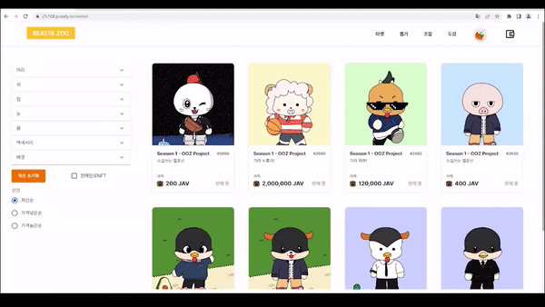

# NFT기반 수집 컨텐츠 : BEASTAZOO

## 목차

[0.요약](#0-요약)

[1. 소개](#1-소개)

[2. 주요기능](#2-주요-기능)

[3. 아키텍처](#3-아키텍처)

[4. ERD 다이어그램](#4-erd-다이어그램)

[5.개발자](#5-개발자)

[6.고민](#6-고민)

[7.느낀점](#7-느낀점)

[8.기타 자료](#8-기타-자료)

---

 

## 0. 요약

### 문서

- UCC : https://youtu.be/4ZNU3LeL8Ec
- Notion : https://subsequent-clementine-6cf.notion.site/C108-4ea7abc743e3497fbac38eb1d59d1b18

### 역할

#### Blockchain

- ERC-20, ERC-721 분석
- SmartContract 로직 설계(NFT 발행, NFT거래 ...)
- NFT 발행 및 거래
- 유전 알고리즘 최적화

#### Frontend

- web3.js를 이용하여 smartcontract 연동
- 자브종(NFT) 상세 페이지(modal) 및 판매 페이지
- 해당 NFT의 유전 비율, 판매 기록 그래프

### 기술 스택

- Solidity, Truffle, web3.js
- React, SCSS, TypeScript
- GirLab, Jira, Figma

### 후기

- Blockchain의 탈중앙화에 대한 개념과 왜 사용하는지 배울 수 있었다.
- Solidity및 블록체인이 가진 문제점에 대해 알 수 있었다.
  - 자료구조, 랜덤, 연산 능력(확장성), 접근성, 에너지 효율
- 기능(성능)과 편의성의 비중에 대해 많은 고민을 할 수 있었다.
  - DApp - backend
  - IPFS - firebase
  - 자산을 중앙에서 관리 - 개인이 관리 (개인 지갑)
- Vue 대비 React의 장점(component 재사용성 등)에 대해 배울 수 있었다.
- 추가적인 후기 : https://ljm0850.tistory.com/123

## 1. 소개

- **BEASTZOO**는 **NFT** 기반의 수집형 컨텐츠 플랫폼입니다.

- **유전 알고리즘**이 적용된 뽑기와 조합을 통해 특정 형태의 NFT를 수집할 수 있습니다.
- NFT에는 유전정보, 원본 사진 주소, 소유자 등이 저장되어 있습니다.
- NFT를 **마켓플레이스**에서 자체토큰 JAV를 이용해 거래할 수 있습니다.

- 도감 시스템과 보상을 이용해 사용자의 수집 욕구를 극대화 시키고, 상위 NFT로 갈 수록 희귀도가 높아져 자연스럽게 시장 경제가 형성되도록 유도했습니다.
- 블록체인에서 **확률**을  계산하여 확률 조작에 관한 문제를 해결하고자 하였습니다.

### 수상

- 삼성 청년 SW 아카데미 프로젝트 우수상
- 특화프로젝트 반 1등

  

---

 

## 2. 주요 기능

> _BEASTAZOO에서 제공하는 주요 기능입니다.
> 서비스를 이해하기 위한 용어를 정의하고 각 기능에서 어떤 것을 경험할 수 있는지 설명하였습니다.

 

#### 1) 회원 가입 및 로그인

- BEASTAZOO 사이트 내에서 **Metamask** 지갑 정보를 이용해 회원가입 및 **로그인**을 진행할 수 있습니다.
- 로그인 창에서 BEASTAZOO 프로젝트에서 사용되는 **자체토큰(JAV)**를 충전 할 수 있습니다.

 

#### 2) 뽑기

- BEASTAZOO에서 메인 컨텐츠로 사용되는 **자브종(NFT)**를 뽑을 수 있는 공간입니다.
- 조합의 기반이 되는 NFT를 전용 거래 토큰인 JAV를 통해 뽑기 페이지에서 얻을 수 있습니다.
- 주로 1티어의 유전정보를 가진 자브종이 등장되며, 낮은 확률로 2티어의 유전 정보를 가진 NFT가 등장합니다.

 

#### 3) 조합

- 뽑기 페이지를 통해 얻은 베이스 자브종(NFT)를 조합페이지에서 **조합**해 새로운 NFT를 얻을 수 있습니다.
- 각각의 자브종에는 **유전**의 영향을 받는 파츠가 존재하며 이는 2개의 자브종을 조합시 BEASTAZOO만의 유전 알고리즘을 통해 다음 세대의 자브종에게 유전됩니다.
- 유전이 적용되는 각 파츠를 조합할 경우, **일정 확률과 조합식**을 통해 기존에는 없던 특정 파츠가 발현됩니다.
- 조합에 사용된 자브종은 **소각**됩니다.

 

#### 4) 마켓플레이스

- 내가 얻은 NFT를 마켓플레이스를 통해 **거래**할 수 있습니다.
- NFT를 사용자 간에 거래할 수 있습니다.
- 해당 NFT의 거래 내역, 소유자 정보를 NFT 상세 페이지에서 확인할 수 있습니다.
- 판매 등록은 프로필페이지에서 가능합니다.
- 마켓

- 판매 등록

- 구매

 

#### 5) 도감

- 도감은 전체 유저가 함께 만들어갑니다.
- 새로운 형태의 NFT가 발견될 경우 도감의 발견 **전체 숫자**가 올라가며, 해당 유전자에는 발견자의 이름이 기록됩니다.(초기에는 0/0의 도감에서 타인이 발견시 0/1로 늘어납니다.)
- 해당 유전 상태로 필터링이 적용된 마켓플레이스로  이동할 수 있습니다.

  

 

#### 6) 마이페이지

- 나의 계정, 지갑 정보를 확인할 수 있습니다.
- 내가 소유 중인 NFT를 확인할 수 있습니다.
- 프로필 사진과 프로필 배경을 통해 마이페이지를 간단하게 커스텀할 수 있습니다.

 

---

 

## 3. 아키텍처

 

#### 1) 아키텍처

 

#### 2) 기술스택

|      Part      |                            Tech ⚙                            |
| :------------: | :----------------------------------------------------------: |
|   **Front**    |  |
|    **Back**    |  |
| **BlockChain** |  |
| **Deployment** |  |

- **OS**: Windows 10

 

* **사용 IDE**

  - IntelliJ IDEA 2022.1.3
  - Visual Studio Code : 1.70.2v
  - UI/UX: Figma

   

* **백엔드 기술스택**

  - Springboot : 2.6.9
  - MariaDB : mariadb Ver 15.1 Distrib 10.3.34-MariaDB, for debian-linux-gnu (x86_64) using readline 5.2
  - AWS : ubuntu 20.04.4 LTS
  - Jenkins : 2.346.2
  - Docker : 20.10.17
  - Openjdk : 11.0.16
  - Spring: gradle
  - nginx : nginx/1.18.0 (Ubuntu)

   

* **프론트엔드 기술스택**

  - node.js : 16.15.0v 64bit (LST 버전 사용)
  - npm : 8.5.5v
  - react : 18.2.0v
  - react-router-dom : 6.3.0v
  - TypeScript : 4.7.4v
  - Sass : 1.54.4v
  
   

* **블록체인 기술스택**

  * Solidity : 0.8.17v 
  * Truffle :  5.5.30v 

---

 

## 4. ERD 다이어그램

---

 

## 5. 개발자

#### 1) Front

|        |        |
| :----: | :----: |
| 임윤혁 | 허재영 |
|        |        |

#### 2) Back

|             |        |
| :---------: | :----: |
| 김세진(+BC) | 김지호 |
|             |        |

#### 3) BlockChain

|             |             |
| :---------: | :---------: |
| 최인호(+FE) | 이재민(+FE) |
|             |             |

---

 

## 6. 고민

- [SC 작성하면서 발생한 문제점](assets/SC_Problem.md)

    
자체 토큰(JAV) 획득 방법을 어떻게 할 것인가?

    

        1.프로젝트가 짧은 시간 동안 서비스 됨   
    

    

        2.획득을 위한 컨텐츠를 만들기엔 시간이 부족   
    

    

        => 프로젝트 목표였던 즐거움과 블록체인 경험에 방해되는 요소이므로 충전 형식으로 무한제공
    

    

        NFT의 원본 사진은 어디에 저장할 것인가?
    

    

        1.IPFS : 분산형 파일 시스템이라 블록체인의 취지에 적합, 불안정한 속도
    

    

        2.Firebase : 중앙 집중형 시스템이라 블록체인의 취지에 적합X, 안정적인 속도
    

    

        => 이미지보단 유전 정보가 중요(유전 정보에 따라 이미지가 구현)
    

    

        => 이더리움 기반 서버에서 트랜잭션 처리 속도에 의해 1차적으로 사용자 경험 감소, IPFS의 불안정한 속도로 인하여 사용자 경험이 크게 떨어진다고 판단하여 Firebase 사용
    

 

## 7. 느낀점

### 피드백에 대한 감사

- 조합시 파츠 티어 정보에 대한 정보를 표현을 안해줘서 불편했었다.
- 이에 관하여 서비스를 이용해준 고객이 피드백을 해줘서 깨달을 수 있었다.

### 이용 고객에 대한 감사

- 프로젝트를 열심히 이용해주셔서 200종이 넘는 도감을 채워주신 분이 있었다.
- 이와 경쟁하여 160종이 넘는 도감을 채워주신 분들이 있었다.
- 이렇게 열심히 프로젝트를 이용해주신 분들이 있어 보람을 느꼈고, 이런 분들께 너무 고마웠다.

### Block Chain 기술

- 빈약한 자료구조 및 연산 성능
- 왜 굳이 Block Chain을 이용 해야 하는가? 에 대한 답변이 고민된다
- 한번 배포 되고 나면 수정이 힘들기에 빈틈 없게 설계 하는것이 중요하다.
- 아직은 미숙하지만, 앞으로 더 발전이 되면 탈중앙화의 가치가 살아나는 서비스가 제공될 것이라고 기대된다.

◎ 프로젝트를 진행하며 추가적으로 느낀점은 [개인 블로그](https://ljm0850.tistory.com/123)에 있습니다.

## 8. 기타 자료

#### 1). [기능 명세서](https://docs.google.com/spreadsheets/d/1nYihrwMp-3F1WZfUZsIlBlxBWfy3kzzC37FAIeUPqJc/edit#gid=0)

#### 2). [와이어 프레임](https://www.figma.com/file/gUwK2fcAqNFBysEASba2al/%EC%8B%A0%EB%8F%99%EC%82%AC-%EC%99%80%EC%9D%B4%EC%96%B4%ED%94%84%EB%A0%88%EC%9E%84?node-id=0%3A1)

#### 3). [포팅 메뉴얼](exec/포팅메뉴얼_특화PJT_(JAV).pdf)

#### 4). [시연 시나리오(PDF)](exec/BEASTAZOO_시연시나리오.pdf)
